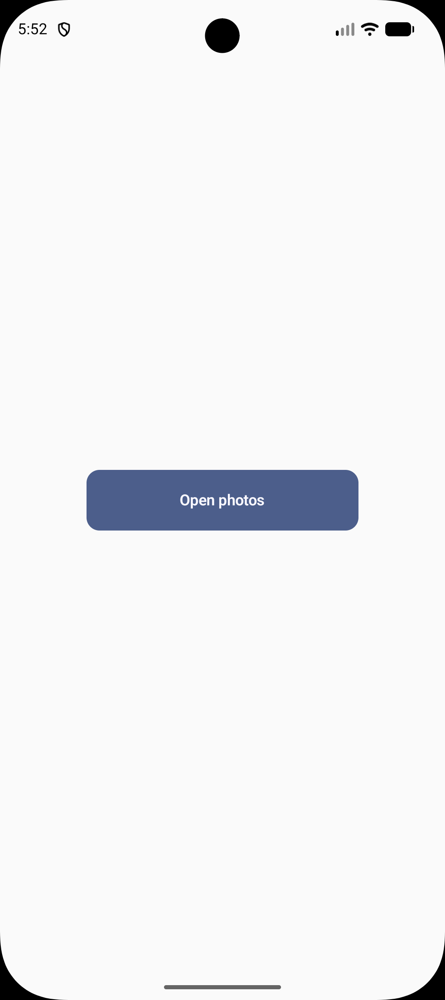
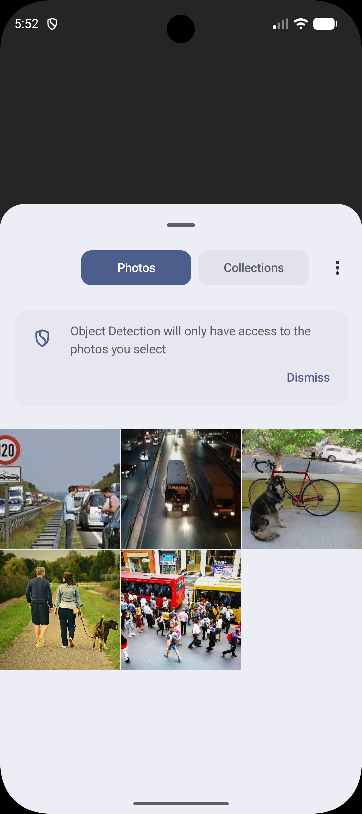
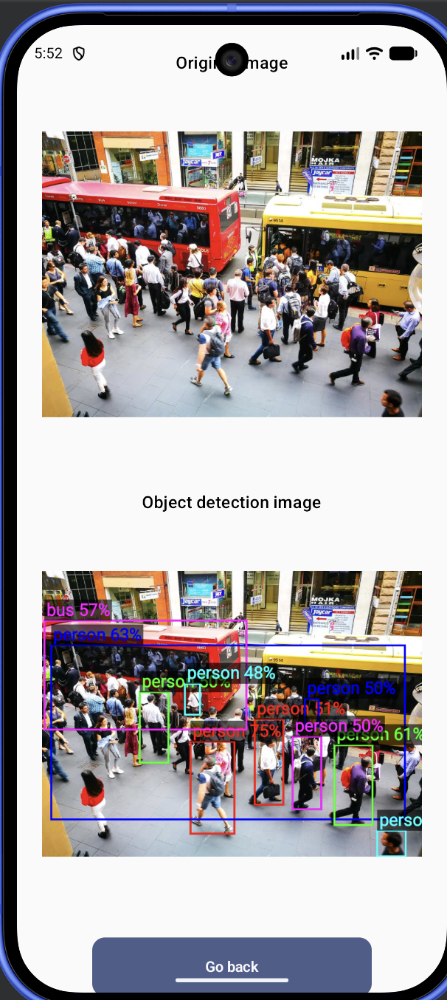
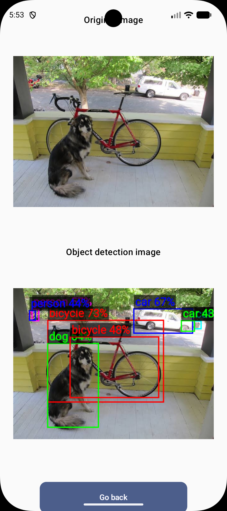

# Android Object Detection

An Android app that runs on-device object detection using **LiteRT (TensorFlow Lite Runtime)**. Pick
any photo from your gallery — the app detects objects, draws labelled bounding boxes, and shows the
result alongside the original image. No internet connection required.

---

## Screenshots

| Home                                          | Photo picker                                    | Result — crowd                                        | Result — dog & bike                                  |
|-----------------------------------------------|-------------------------------------------------|-------------------------------------------------------|------------------------------------------------------|
|  |  |  |  |

---

## Architecture

The project follows **Clean Architecture** with a strict unidirectional dependency rule:

```
Presentation  →  Domain  ←  Data
```

Each layer only depends inward. The domain layer has zero Android dependencies.

```
┌─────────────────────────────────────────────────────────┐
│  Presentation (Compose + ViewModel)                     │
│   HomeScreen → picks image                              │
│   ResultScreen → shows original + annotated image       │
└────────────────────┬────────────────────────────────────┘
                     │ calls use cases
┌────────────────────▼────────────────────────────────────┐
│  Domain (pure Kotlin)                                   │
│   LoadImageUseCase                                      │
│   DetectObjectsUseCase                                  │
│   DrawBoundingBoxesUseCase                              │
│   DetectionRepository / ImageRepository / BitmapRenderer│
└────────────────────┬────────────────────────────────────┘
                     │ implemented by
┌────────────────────▼────────────────────────────────────┐
│  Data                                                   │
│   TfliteObjectDetector  ←  LiteRT interpreter           │
│   DetectionRepositoryImpl                               │
│   ImageRepositoryImpl   ←  ContentResolver              │
│   BitmapRendererImpl    ←  Canvas drawing               │
└─────────────────────────────────────────────────────────┘
```

---

## Folder Structure

```
android_object_detection/
├── gradle/
│   └── libs.versions.toml              # centralised version catalog
├── app/
│   ├── build.gradle.kts
│   └── src/
│       ├── main/
│       │   ├── assets/
│       │   │   ├── efficientdet_lite0.tflite   # SSD MobileNet V1 COCO quantized
│       │   │   └── coco_labels.txt             # 80 COCO class labels
│       │   ├── AndroidManifest.xml
│       │   └── java/com/example/android_object_detection/
│       │       │
│       │       ├── core/
│       │       │   └── util/
│       │       │       ├── Result.kt           # sealed interface: Success / Error / Loading
│       │       │       └── ErrorMessages.kt    # string constants for error states
│       │       │
│       │       ├── domain/
│       │       │   ├── model/
│       │       │   │   ├── DetectionResult.kt  # label + confidence + bounding box
│       │       │   │   └── BoundingBox.kt      # left / top / right / bottom (pixels)
│       │       │   ├── repository/
│       │       │   │   ├── DetectionRepository.kt
│       │       │   │   ├── ImageRepository.kt
│       │       │   │   └── BitmapRenderer.kt
│       │       │   └── usecase/
│       │       │       ├── LoadImageUseCase.kt
│       │       │       ├── DetectObjectsUseCase.kt
│       │       │       └── DrawBoundingBoxesUseCase.kt
│       │       │
│       │       ├── data/
│       │       │   ├── detector/
│       │       │   │   ├── ObjectDetector.kt          # interface: detect(Bitmap)
│       │       │   │   └── TfliteObjectDetector.kt    # LiteRT implementation
│       │       │   └── repository/
│       │       │       ├── DetectionRepositoryImpl.kt
│       │       │       ├── ImageRepositoryImpl.kt
│       │       │       └── BitmapRendererImpl.kt
│       │       │
│       │       ├── di/
│       │       │   └── AppModule.kt            # Hilt bindings
│       │       │
│       │       ├── presentation/
│       │       │   ├── components/
│       │       │   │   └── PrimaryButton.kt
│       │       │   ├── home/
│       │       │   │   ├── HomeScreen.kt
│       │       │   │   ├── HomeViewModel.kt
│       │       │   │   ├── HomeUiState.kt
│       │       │   │   └── HomeNavEntry.kt
│       │       │   ├── result/
│       │       │   │   ├── ResultScreen.kt
│       │       │   │   ├── ResultViewModel.kt
│       │       │   │   ├── ResultUiState.kt
│       │       │   │   └── ResultNavEntry.kt
│       │       │   ├── navigation/
│       │       │   │   ├── AppNavGraph.kt
│       │       │   │   ├── Navigator.kt
│       │       │   │   └── Route.kt
│       │       │   └── theme/
│       │       │       └── AppTheme.kt
│       │       │
│       │       ├── ObjectDetectionApp.kt       # @HiltAndroidApp
│       │       └── MainActivity.kt             # @AndroidEntryPoint
│       │
│       └── test/
│           └── java/com/example/android_object_detection/
│               ├── data/
│               │   ├── detector/
│               │   │   └── FakeObjectDetector.kt        # test double
│               │   └── repository/
│               │       └── DetectionRepositoryImplTest.kt
│               └── domain/
│                   └── usecase/
│                       └── DetectObjectsUseCaseTest.kt
```

---

## Tech Stack

| Concern              | Library                                            |
|----------------------|----------------------------------------------------|
| Language             | Kotlin 2.3.20                                      |
| UI                   | Jetpack Compose + Material3                        |
| Navigation           | Navigation3 1.1.0                                  |
| Dependency injection | Hilt 2.59.2                                        |
| Object detection     | LiteRT (TFLite) 2.1.4                              |
| Image loading        | Coil 2.7.0                                         |
| Async                | Kotlin Coroutines + Flow                           |
| Testing              | JUnit4 · Mockk · Turbine · kotlinx-coroutines-test |
| Build                | AGP 9.1.1 · Gradle version catalog                 |

---

## Detection Pipeline

```
URI string
   │
   ▼ LoadImageUseCase
ByteArray (raw image bytes)
   │
   ▼ DetectObjectsUseCase
   │   └── DetectionRepositoryImpl
   │         └── TfliteObjectDetector
   │               ├── resize bitmap → 300×300
   │               ├── extract RGB pixels → ByteBuffer (UINT8)
   │               └── Interpreter.runForMultipleInputsOutputs()
   │                     outputs: boxes · classes · scores · count
   │
List<DetectionResult>
   │
   ▼ DrawBoundingBoxesUseCase
   │   └── BitmapRendererImpl (Canvas)
   │
ByteArray (annotated PNG)
   │
   ▼ ResultScreen
```

---

## Model

| Property             | Value                                                                                                                                                  |
|----------------------|--------------------------------------------------------------------------------------------------------------------------------------------------------|
| File                 | `assets/efficientdet_lite0.tflite`                                                                                                                     |
| Architecture         | SSD MobileNet V1                                                                                                                                       |
| Dataset              | COCO (80 classes)                                                                                                                                      |
| Input                | 300 × 300 RGB UINT8                                                                                                                                    |
| Max detections       | 10                                                                                                                                                     |
| Confidence threshold | 40%                                                                                                                                                    |
| Source               | [TFLite object detection example](https://storage.googleapis.com/download.tensorflow.org/models/tflite/coco_ssd_mobilenet_v1_1.0_quant_2018_06_29.zip) |

---

## Getting Started

### Prerequisites

- Android Studio Meerkat or newer
- Android device / emulator running API 26+
- JDK 17

### Build & run

```bash
git clone <repo-url>
cd android_object_detection
./gradlew installDebug
```

### Run unit tests

```bash
./gradlew testDebugUnitTest
```

---

## Key Design Decisions

**Why LiteRT instead of ML Kit?**
LiteRT gives direct control over model selection, input preprocessing, and output parsing. ML Kit is
a convenience wrapper with limited flexibility and requires Google Play Services on the device.

**Why a separate `ObjectDetector` interface?**
`DetectionRepositoryImpl` depends on the interface, not the concrete TFLite class. This makes the
repository fully unit-testable with `FakeObjectDetector` — no Android runtime needed.

**Why `Dispatchers.Default` for inference?**
TFLite inference is CPU-bound, not I/O-bound. `Dispatchers.Default` uses a thread pool sized to the
number of CPU cores, which is the right scheduler for compute work.

**Why is `TfliteObjectDetector` a singleton?**
The `Interpreter` is expensive to construct (model file mapping + JNI initialisation). Making it a
singleton means it is created once on first use and reused for every detection call.
